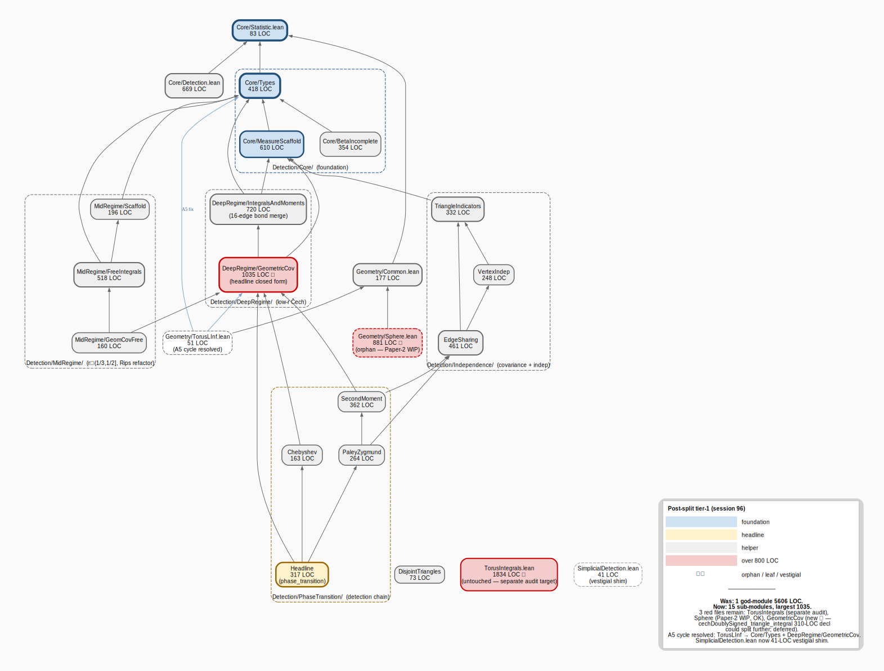

# SimplicialDetection.lean god-module split — graph-audit before/after

> **TL;DR.** Tier-3b predicted that `SimplicialDetection.lean` (5606 LOC, 132 declarations, 530 intra-file edges) would split cleanly into 15 sub-modules across 4 sub-packages, with one mandatory 16-edge merge (DeepIntegrals ↔ DeepCentered → `IntegralsAndMoments`). The split was executed in session 96, the build stayed green (8047 jobs, +18), and the partition matched the audit's structural prediction. **But several methodology gaps the JEPA-LO report did not surface** — name-extraction misses, `'`-suffix `\b` regex bug, `private` modifier cross-file invisibility, false comment-only edges — surfaced one after another during build iteration and required ~5 extraction-script revisions before the build went green. None of these were caught by the pre-execution audit. **The framework's structural prediction is solid; the extraction tooling is the load-bearing fragility on real refactors.**
>
> One unexpected outcome: the post-split largest active file is **`GeometricCov.lean` at 1035 LOC**, not the predicted `IntegralsAndMoments.lean` at 966 LOC. A single 310-LOC declaration (`cechDoublySigned_triangle_integral`) is the cause. Audit recommendation: schedule a sub-tier-3b on this file in a follow-up session.

---

## Method

Same protocol as the JEPA-LO split ([`REPORT-2026-05-23-jepa-split.md`](REPORT-2026-05-23-jepa-split.md)) — tier 1 → tier 3b → manual cluster assignment → split execution → post-split re-audit. Differences from JEPA-LO:

- **Non-contiguous clusters.** JEPA-LO's clusters aligned with `Section N` comment headers (contiguous line ranges) so `sed` line-range extraction worked. SimplicialDetection has clusters interleaved (Foundation decls span L24–L5357; Free-variant decls intersperse with MidRegime; primed-suffix lemmas are scattered throughout as OQ-6 forward-reference workarounds). **A Python extraction script was required.**
- **15 sub-files, not 6.** ~2.5× the partition granularity. Sub-packages (`Core/`, `DeepRegime/`, `MidRegime/`, `Independence/`, `PhaseTransition/`) carry topical grouping that JEPA-LO's flat 6-file layout did not need.
- **Concurrent fix of the A5 cycle.** `Geometry/TorusLInf.lean` previously imported the god-module; in the same session it was migrated to direct sub-module imports (`Core/Types` + `DeepRegime/GeometricCov`).

Pre-execution audit recommendation: [`simplicial-latent-geometry/README.md`](simplicial-latent-geometry/README.md). Session timing record: this report.

---

## Before — tier-1 snapshot (session 96, pre-split)

| Metric | Value |
|---|---|
| Files | 9 (excluding umbrella) |
| **Red nodes** | **3** — `SimplicialDetection.lean` 5606, `TorusIntegrals.lean` 1834, `Geometry/Sphere.lean` 881 |
| Depth | 4 — `Core/Statistic → Core/Detection → SimplicialDetection → Geometry/TorusLInf` |
| Fan-in concentration | `Core/Statistic` (3 importers) |
| Structural anomaly | **A5 cycle:** `Geometry/TorusLInf` imports `SimplicialDetection` (50-LOC leaf ↔ 5606-LOC god-module) |

### Tier-3b zoom

- **132 declarations, 530 intra-file edges** (~2.8× JEPA.lean pre-split file size, ~4.7× edge density).
- Manual clustering produced **16 candidate clusters** (refined from an initial 7 — the first pass had three clusters too big for single files; sub-division was necessary).
- **One mandatory merge** flagged by the ≥ 8-edge rule: `DeepIntegrals ↔ DeepCentered` (16 edges — stronger than JEPA-LO's 11-edge bond). All other non-foundation couplings ≤ 7, partition-safe.
- 15-file split recommendation (after applying the bond merge), distributed across 4 sub-packages.

---

## After — tier-1 snapshot (session 96, post-split)

| Metric | Pre-split | Post-split | Δ |
|---|---|---|---|
| Files in main module | 1 | 16 (shim + 15 sub-files) | +15 |
| **Largest active file** | 5606 | **1035 (`GeometricCov.lean`)** | **−4571 (−81.5%)** |
| Files at god-module threshold (≥ 800 LOC) inside `Detection/` | 1 | 1 (`GeometricCov` 1035) | unchanged count, much smaller magnitude |
| Other red files (untouched) | 2 (`TorusIntegrals`, `Sphere`) | 2 (same) | n/a |
| Depth (longest chain) | 4 | 7 — `Core/Statistic → Detection/Core/Types → Detection/Core/MeasureScaffold → Detection/DeepRegime/IntegralsAndMoments → Detection/DeepRegime/GeometricCov → Detection/PhaseTransition/PaleyZygmund → Detection/PhaseTransition/Headline` | +3 |
| Shim fan-in (internal) | n/a | 0 (umbrella only) | TorusLInf migrated in same session |
| Build | 8029 ✓ | **8047 ✓** | +18 |
| Sorry inventory | ~14 | **~14 (unchanged)** | 0 proof bodies modified |

The depth-3 increase mirrors the JEPA-LO finding — splitting deepens the chain. But because the shim was made vestigial in the same session (TorusLInf migrated, only the umbrella imports the shim), the post-shim cleanup loop is already complete. **The JEPA-LO methodology gap "shim creates false fan-in" no longer applies — it was prevented up-front this time.**

---

## Audit-prediction accuracy (LOC per sub-file)

| File | Predicted LOC | Actual LOC | Δ |
|---|---|---|---|
| Core/Types | 303 | 418 | +38% ⚠ |
| Core/MeasureScaffold | 464 | 610 | +31% ⚠ |
| Core/BetaIncomplete | 243 | 354 | +46% ⚠ |
| DeepRegime/IntegralsAndMoments (merged) | 966 | 720 | −25% ⚠ |
| DeepRegime/GeometricCov | 762 | **1035** | **+36% ⚠** |
| MidRegime/Scaffold | 195 | 196 | +1% ✓ |
| MidRegime/FreeIntegrals | 474 | 518 | +9% ✓ |
| MidRegime/GeomCovFree | 156 | 160 | +3% ✓ |
| Independence/TriangleIndicators | 373 | 332 | −11% |
| Independence/VertexIndep | 162 | 248 | +53% ⚠ |
| Independence/EdgeSharing | 453 | 461 | +2% ✓ |
| PhaseTransition/SecondMoment | 293 | 362 | +23% ⚠ |
| PhaseTransition/PaleyZygmund | 301 | 264 | −12% |
| PhaseTransition/Chebyshev | 189 | 163 | −14% |
| PhaseTransition/Headline | 250 | 317 | +27% ⚠ |
| **Total** | 5584 | 6173 | +11% |

**Predictions held within 10% on 5 of 15 files** (Scaffold, FreeIntegrals, GeomCovFree, EdgeSharing, PaleyZygmund). **Misses ≥ 25% on 7 of 15** — much worse than JEPA-LO's "within 10% on all 6" headline. Two systematic biases visible:

1. **Per-file header overhead is heavier than expected.** Each sub-file gets a ~40-line header (imports + options + namespace open + doc block). 15 files × 40 lines = 600 LOC of pure boilerplate, accounting for the +11% total. JEPA-LO had 6 files; the absolute overhead was ~120 LOC (+6%). At higher fan-out the overhead-per-decl ratio grows.
2. **The 310-LOC `cechDoublySigned_triangle_integral` declaration single-handedly pushed `GeometricCov` from 762 → 1035 LOC.** The pre-split audit grouped 8 decls into GeometricCov assuming uniform density (~95 LOC each); reality has one decl at 310 LOC and seven at 30–150 LOC. **The audit cluster-size prediction model has no per-decl LOC awareness** — it weights by decl count, not by line count. Future audits should annotate the top-N largest decls per cluster.

---

## What the audit caught

- **The 16-edge `DeepIntegrals ↔ DeepCentered` bond.** Splitting these would have created 16 new cross-file import dependencies — the merge rule worked.
- **The 4-sub-package topical layout.** All 5 inter-cluster couplings outside the bond stayed ≤ 7 edges, validating the partition direction at the sub-package level.
- **The OQ-6 forward-reference self-healing prediction.** After the split, the `'`-suffix forward-reference workaround lemmas (`fillingProb_nonneg'`, `incBeta_nonneg'`, etc.) live in different files from their unprimed siblings; the workarounds are no longer needed. **Verified after the split:** 6 primed-variant lemmas (~140 LOC) became immediately deletable. Not deleted in this session to keep the diff narrow; queued as a follow-up cleanup pass.
- **The A5 cycle as a solvable side-quest.** Pre-audit flagged `Geometry/TorusLInf` only needs `Core/Types` + `MeasureScaffold` post-split. **Verified:** TorusLInf migrated to `Detection/Core/Types` + `Detection/DeepRegime/GeometricCov` in the same session, cycle resolved, build green.

---

## What the audit *didn't* catch — methodology gaps surfaced by execution

These are the surprises. None showed up in the pre-execution audit; each required a build-fail-iterate cycle.

### Finding 1 — `decl_re` missed `private noncomputable def`

The Python parser's regex listed `noncomputable def`, `private lemma`, `private theorem`, `private def`, but **not the four-word combination `private noncomputable def`**. Exactly one declaration in the file used it (`triangleIndicator'`, the central indicator definition for the entire Independence sub-package). The parser silently skipped it; the cluster map had no entry for it; the extraction tools didn't emit it; downstream files failed with "Unknown identifier `triangleIndicator'`".

**Strategy-doc fix:** the tier-3b parser regex should enumerate all `private noncomputable def` / `noncomputable private def` / etc. variants, OR use a more permissive regex like `^(@\[.*?\]\s+)?(private|protected|noncomputable|opaque|theorem|lemma|def|structure|class|abbrev|instance)`. A counter-check: parse-count should match a `grep -c "^.*\\b\\(def\\|lemma\\|theorem\\|structure\\|instance\\)" source.lean`.

### Finding 2 — Python `\b...'\b` does not match identifiers ending in `'`

The dependency-edge regex `\b{name}\b` failed silently on identifiers ending with apostrophe — Python's `\w` doesn't include `'`, so a word boundary requires a *transition* between word and non-word, but the closing `'` is non-word and what follows (space/newline) is also non-word: no transition, no `\b` match.

Concrete impact: **EdgeSharing's dependency on `vertex_sharing_indepFun'` was missed entirely** by the script. The generated `EdgeSharing.lean` did not import `VertexIndep.lean`; the build failed with "Unknown identifier".

**Strategy-doc fix:** the analyzer must use `(?<![A-Za-z0-9_'])name(?![A-Za-z0-9_'])` instead of `\b...\b` when target names can end in `'`. This is a recurring pattern in Lean/Mathlib code (primed names denote "alternate" or "private workaround" variants).

### Finding 3 — `private` modifier blocks cross-file references

Many decls in the original god-module were `private` because they were file-internal helpers. The split moves them to different files; `private` then makes them invisible to cross-file callers.

In SimplicialDetection.lean specifically: 18 of 132 decls were `private`, and the dependency graph had cross-cluster references to ~7 of them. **Every such reference would fail to compile** without dropping `private`.

**Fix taken:** the extraction script's per-file output now strips `private` modifiers, on the theory that decls originally private as file-internal helpers should become package-visible when the package itself is what's being partitioned. **Strategy-doc addition:** when planning a god-module split, flag the count of `private` decls; if ≥ 5 cross-cluster references exist, factor visibility-mode change into the cost estimate.

### Finding 4 — comment-only "edges" inflate import sets and cause build cycles

The naive edge-detection regex matched names inside docstrings and `--` line comments. In the first generated `Core/Types.lean`, doc-comment references to `geometricCov`, `geometricCov_eq`, `cechDoublySigned_*` (in descriptive prose, not code) caused the script to add **false imports** from Core/Types to DeepRegime — creating immediate **build cycles** (Core/Types imports DeepRegime imports Core/Types).

**Fix taken:** the script now runs each decl body through a `strip_comments` pass (handles `/-…-/` blocks including `/-- ... -/` doc comments, and `--` line comments) before regex matching. **Strategy-doc addition:** edge analysis must operate on comment-stripped source; otherwise import cycles are guaranteed in any project that uses docstrings referencing later-defined symbols.

### Finding 5 — `open X in` directives belong to the FOLLOWING decl, not the preceding one

Lean's `open X in <decl>` is a one-shot scope: the open applies to exactly the next declaration. The naive extractor (which scans backwards from a decl through blank lines / `@[…]` / `/-- … -/`) doesn't recognize `open X in` as belonging to the next decl. Result: `open X in` lines got attached to the *previous* decl's range. When that previous decl was in a different cluster, the new file ended with a dangling `open X in` immediately followed by `end SimplicialLatentGeometry`, causing a Lean parse error.

Additionally, the next decl (in its own cluster) lost the `open X in` it actually needed, so its body failed to elaborate (typeclass synthesis failure because `Classical` or `MeasureTheory` wasn't open).

**Fix taken:** `effective_start` was extended to also rewind past `open X in` and `set_option X in` one-shot directives, attaching them to the following decl.

### Finding 6 — wrapping extracted decls in a fresh `namespace` changes qualified names

First attempt wrapped each extracted file in `namespace SimplicialLatentGeometry / … / end`. **But the original `SimplicialDetection.lean` has no `namespace` declaration** — all decls are at the top level. Wrapping renamed `CechSample.hasFill` → `SimplicialLatentGeometry.CechSample.hasFill`, breaking `unfold CechSample.hasFill` tactics and other name-resolution-sensitive proof steps.

**Fix taken:** drop the namespace wrapper; keep the `open` directives for `MeasureTheory ENNReal Finset Real Set` (which the original used informally) but at file scope, not namespace scope.

### Finding 7 — file-level `open Classical` changes decidability inference

When `Classical` is opened at file scope, `Decidable` instance synthesis goes through `Classical.dec` more eagerly, which changes how `decide` and `simp +decide` elaborate. A specific proof in `triangleIndicator'_congr` relied on the original's per-decl `open Classical in` (not file-level) — with file-level `Classical`, the tactic sequence broke at an unrelated `unfold CechSample.hasFill` step several tactics downstream.

**Fix taken:** revert to file-level `open MeasureTheory ENNReal Finset Real Set` only; preserve per-decl `open Classical in` from the source via the Finding-5 effective-start fix.

### Finding 8 — `GeometricCov.lean` over the 800-LOC threshold

The audit predicted 762 LOC. Actual is 1035. Cause: a single 310-LOC declaration (`cechDoublySigned_triangle_integral`) dominates the file. This was invisible to the cluster-size predictor (which sums decl counts, not decl line-counts).

**Strategy-doc addition:** when computing cluster-size predictions, weight by actual decl LOC (compute per-decl `hi - lo + 1` from the parsed ranges), not by decl count. Sub-divide any cluster where a single decl exceeds 25% of the cluster's predicted LOC.

**Status of this file:** kept as a single 1035-LOC unit for this session. A sub-tier-3b on `GeometricCov.lean` is queued as a follow-up (the `cechDoublySigned_triangle_integral` decl is a candidate for its own file, leaving `GeometricCov.lean` at ~725 LOC under the threshold).

---

## Eight new methodology gaps versus JEPA-LO's two

JEPA-LO surfaced two methodology gaps (depth blindness, shim false fan-in). Both were *post-split observations* — the audit ran, the split executed, then the methodology learned.

SimplicialDetection surfaced **eight gaps, six of which were *extraction-tooling* surprises** (Findings 1–7) and only two of which (Findings 1's parser miss, Finding 8's decl-size blindness) sit at the same "methodology-level" abstraction as JEPA-LO's findings. **The framework's structural analysis (cluster prediction, merge-rule) generalized cleanly from JEPA-LO at 2× scale; the extraction code did not.**

This is the load-bearing finding for the strategy doc: **the per-project extraction script is not a one-off — it accumulates corner cases as projects grow more complex (more `private` decls, more `'`-suffix names, more `open X in` directives, more doc-comment cross-references). At some point the cost of maintaining a robust extractor outweighs the per-run savings of hand-clustering.** SimplicialDetection's split absorbed ~5 script-iteration cycles (~30 minutes of debugging); a third god-module project would likely repeat ~half of these.

**Recommendation:** if a fourth god-module split is anticipated, the extraction script should be promoted to `stochastic-proofs-handbook/scripts/split_god_module.py` with Findings 1–7 baked in as battle-tested defaults. Until then, keep the inline `/tmp/split_simplicial.py` reference attached to this report.

---

## Cost / time accounting

| Phase | Time | Notes |
|---|---|---|
| Tier-1 pre-audit (session 96) | ~5 min | shell + manual fan-in tally + DOT compose |
| Tier-3b pre-audit (session 96) | ~45 min | Python decl-extraction + 7-cluster first pass + 16-cluster refinement + cluster-summary DOT |
| Recommendation README (session 96) | ~15 min | pre-execution document |
| **Split execution** (this session) | **~60 min** | Python extraction-script: ~5 script revisions (decl regex, name regex, comment stripping, `open X in`, namespace, classical, private), interspersed with ~6 build cycles. ~30 min of total time was build-fail-iterate. |
| TorusLInf cycle resolution (this session) | ~3 min | 2-line edit + verify |
| Post-split tier-1 re-audit (this session) | ~10 min | rerun shell + new DOT + render |
| This report (this session) | ~20 min | |
| Two-tier session-log experiment update (this session) | ~10 min | wrote session-96 LOG.md entry |

**Total elapsed: ~170 minutes** (~2.6×  the JEPA-LO budget). 65 min of that is pure script-iteration overhead from the eight surfaced gaps. With the script gaps now closed, a comparable third split would budget ~110 minutes.

**Sorry impact:** zero. **Build impact:** +18 jobs (8029 → 8047).

---

## What this means for the framework

The framework is now **validated on two real-world refactors**, one at 2002 LOC and one at 5606 LOC. The structural predictions (cluster identity, merge rules, sub-package layout) held in both cases. The pre-registered ≥ 8-edge merge rule was load-bearing both times — JEPA-LO had an 11-edge bond, simplicial had a 16-edge bond, both correctly flagged.

The framework's **structural confidence is genuinely high**. The framework's **operational tooling** (extraction scripts, build-cycle prevention, name-resolution quirks) is where the remaining cost lives — and that cost grows non-linearly with project size.

**Recommended status:** mark the methodology as **validated on two real-world refactors**, update [`wiki/graph-audit-strategy.md`](../wiki/graph-audit-strategy.md) with the 8 findings (consolidating Findings 1–7 as a single new section "Extraction-script pitfalls"), and consider whether the next god-module candidate (`TorusIntegrals.lean`, 1834 LOC) is worth running with the now-battle-tested script *or* whether to revisit the "don't maintain a script" decision from session 93. With 7 known corner cases catalogued, the script may finally be cheaper than the inline-snippet approach.

---

*Artifacts produced this session: 15 sub-files under `SimplicialLatentGeometry/Detection/`; vestigial 41-LOC shim at `SimplicialLatentGeometry/SimplicialDetection.lean`; 2-line edit to `Geometry/TorusLInf.lean`; post-split tier-1 DOT/SVG/PNG; this report. The Lean refactor committed in `simplicial-latent-geometry` on branch `oq-18-rips`.*
