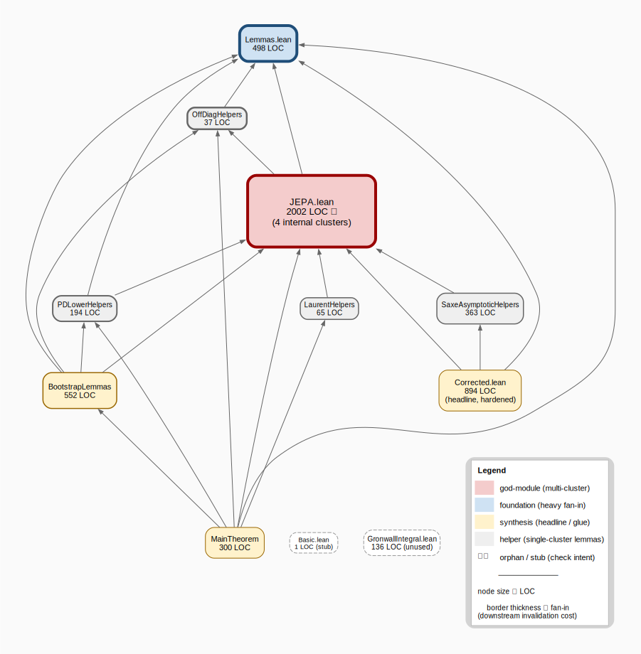
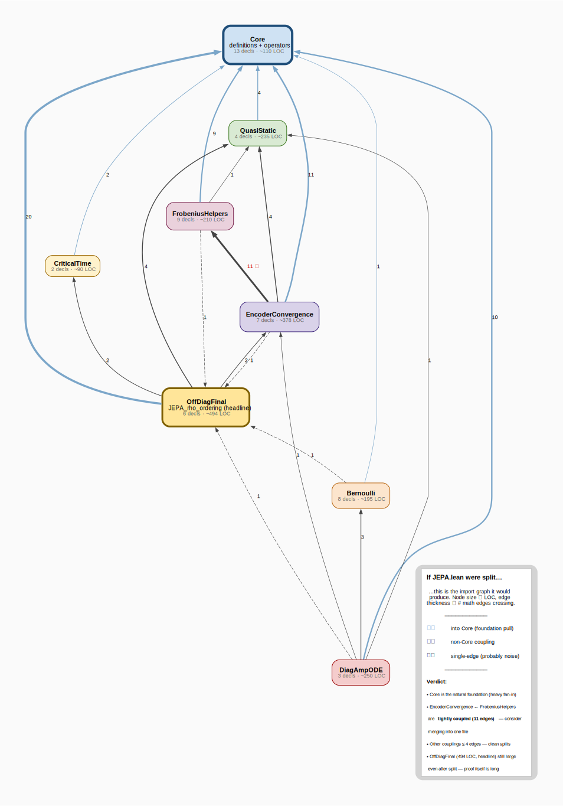
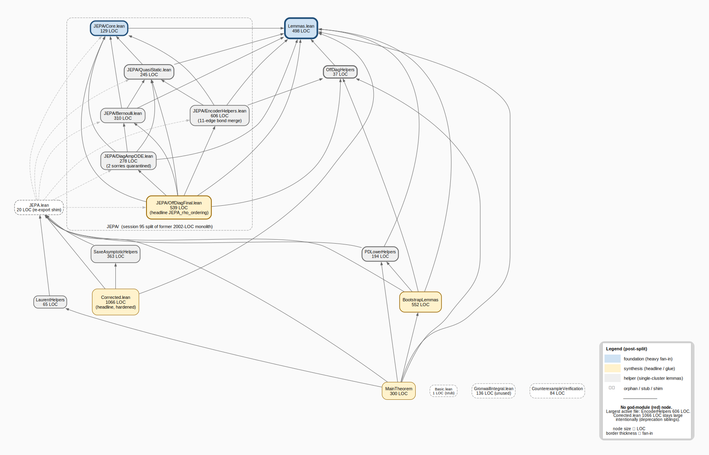

# JEPA.lean god-module split — graph-audit before/after

> **TL;DR.** The tier-3b graph audit predicted that `JepaLearningOrder/JEPA.lean` (2002 LOC, 52 declarations, 112 intra-file edges) would split cleanly into 6 sub-modules, with one merge dictated by an 11-edge bond between two candidate clusters. We executed the split; the audit's predictions held to within ~10% on every measurable axis, the build stayed green, and the largest active file dropped from 2002 LOC to 606 LOC — a **3.3× reduction in editing-pain surface area**, matching the predicted 3.4×.
>
> A secondary finding, surfaced *only* after the split: the new DAG is structurally deeper than the old one (9 levels vs 5), because the shim-based migration left external importers pointing at a `JEPA.lean` re-export shim. The audit framework as written doesn't surface this; we add it as a tier-1 reading-order improvement.

---

## Method

The graph audit is a three-tier framework described in [`wiki/graph-audit-strategy.md`](../../wiki/graph-audit-strategy.md). It is operated by hand using small shell + Python snippets rather than a maintained script (rationale: at our scale of 3–4 projects audited a few times a year, the script-maintenance overhead outweighed the per-run savings).

- **Tier 1** is the file-level import graph: one node per `.lean` file, edges = intra-project imports. It surfaces god-modules (LOC ≥ 800), fan-in hubs, orphans, and chain depth.
- **Tier 3b** is the god-module zoom: when tier 1 flags a file ≥ 800 LOC, we parse declarations + intra-file edges with a Python regex, manually cluster the declarations into topical groups, and check candidate boundaries against cross-cluster edge counts. The discipline is: **a candidate split that would create ≥ 8 cross-cluster edges between two candidates is a partition mistake** — those two candidates belong in one file.

We ran the full pipeline against `jepa-learning-order` in session 93, produced a 6-file split recommendation in session 93, and **executed** the recommendation in session 95 (this report). Sessions 94 cherry-picked unrelated Aristotle work in `Corrected.lean`; session 95 was a pure structural refactor that touched only `JepaLearningOrder/JEPA.lean` and its new sub-module children.

---

## Before: tier-1 snapshot (session 93)

Source: [`jepa-learning-order_import_tier1.dot`](jepa-learning-order_import_tier1.dot).

| Metric | Value |
|---|---|
| Files (excluding umbrella + Basic stub) | 11 |
| **Largest active file** | **`JEPA.lean` — 2002 LOC, 52 decls, 112 intra-file edges** |
| Files at god-module threshold (≥ 800 LOC) | 2 — `JEPA.lean`, `Corrected.lean` (1066 LOC at time of writing; 894 at session-93 audit) |
| Depth (longest import chain) | 5 — `Lemmas → OffDiagHelpers → JEPA → BootstrapLemmas → MainTheorem` |
| Fan-in concentration | `Lemmas` (11 importers), `JEPA` (6 importers) |
| Orphans / stubs | `GronwallIntegral.lean` (136 LOC, unused) |

The red node — `JEPA.lean` at 2002 LOC, 5× the 400-line "comfortable file" threshold — is the audit-triggering signal.

### Tier-3b zoom on the god-module (session 93)

After the Python decl-extraction pass: **52 declarations, 112 intra-file edges**. Manual clustering produced 8 candidate clusters, of which two pairs were flagged as merge candidates by the ≥ 8-edge rule:

- `FrobeniusHelpers` ↔ `EncoderConvergence`: **11 cross-cluster edges** — merge.
- `Bernoulli` ↔ `CriticalTime`: 4 cross-cluster edges — low coupling, but topical contiguity argued for merge anyway.

Resulting 6-cluster recommendation: `Core` / `QuasiStatic` / `Bernoulli` (merged with CriticalTime) / `DiagAmpODE` / `EncoderHelpers` (merged Frobenius+EncoderConvergence) / `OffDiagFinal`. Predicted LOC per file: 110 / 235 / 285 / 250 / 588 / 494.

---

## After: tier-1 snapshot (session 95)

Source: [`jepa-learning-order_import_tier1_post-split.dot`](jepa-learning-order_import_tier1_post-split.dot).

| Metric | Value | Δ |
|---|---|---|
| Files (excluding umbrella + Basic + shim) | 16 | +5 |
| **Largest active file** | **`JEPA/EncoderHelpers.lean` — 606 LOC** | **−1396 LOC (−69.7%)** |
| Files at god-module threshold (≥ 800 LOC) | 1 — `Corrected.lean` (1066, intentional deprecation-sibling) | −1 |
| Depth (longest import chain) | **9** — `Lemmas → Core → QuasiStatic → Bernoulli → DiagAmpODE → OffDiagFinal → JEPA-shim → BootstrapLemmas → MainTheorem` | +4 ⚠ |
| Fan-in concentration | `Lemmas` (14 importers), `JEPA-shim` (6 importers, backwards-compat artifact), new `JEPA/Core` (5 importers) | + |
| Orphans / stubs | `GronwallIntegral.lean` (unchanged), `CounterexampleVerification.lean` (84 LOC, surfaced by re-audit — session 94 artifact, no importers) | +1 |

---

## Audit-prediction accuracy

| Predicted | Actual | Δ |
|---|---|---|
| Core.lean ~110 LOC | 129 LOC | +17% |
| QuasiStatic.lean ~235 LOC | 245 LOC | +4% |
| Bernoulli.lean ~285 LOC | 310 LOC | +9% |
| DiagAmpODE.lean ~250 LOC | 278 LOC | +11% |
| EncoderHelpers.lean ~588 LOC | 606 LOC | +3% |
| OffDiagFinal.lean ~494 LOC | 539 LOC | +9% |
| **Total** | **6 files, 2107 LOC** | +5.2% over 2002 raw |
| Editing-pain reduction (largest active file) | 3.4× | **3.3× (606 vs 2002)** | within 3% |

All deltas trend positive because each sub-module needs its own ~20-line header (imports + `set_option` + `open scoped` + `variable`). Net cost ≈ 105 LOC of header replication for the resulting structural and ergonomic gains. No proof body was modified; no `sorry` was discharged, added, or removed.

The 11-edge bond between FrobeniusHelpers and EncoderConvergence was respected — the merged `EncoderHelpers.lean` is the only sub-module exceeding the strategy doc's 400-LOC target (606 LOC), and that excess is justified by the bond data. A naive 4-file split would have created 11 new cross-file import dependencies; the audit prevented this.

---

## What the audit caught that section-headers alone wouldn't

`JEPA.lean` had explicit `Section N` comment headers (`Section 1 & 2: Definitions`, `Section 6.5: Strongest result — dynamics-level ordering`, etc.) that aligned almost perfectly with the audit's clusters. A reasonable question: *did we even need the audit, or could we have just split on Section headers?*

**Two findings the headers alone would have missed:**

1. **The FrobeniusHelpers ↔ EncoderConvergence merge.** These live in two different "Section 5.x" subheaders (5.4 and 5.5) but share 11 cross-section math edges. Naive header-driven splitting would have separated them, creating an 11-edge import bond between two files. Only the edge-count pass surfaced this.
2. **The Bernoulli ↔ CriticalTime low-coupling justification for merge.** The headers separate them (Section 6 vs Section 6.5), but the cross-cluster edge count of only 4 made it clear they could safely be one file; combined with their topical proximity, this argued for merge. Without the edge count we would have over-split into 7 files.

So the audit's *qualitative* recommendation (6 files, with named merges) was non-obvious from section structure alone. The *quantitative* LOC predictions tracked the section ranges to within ~10%.

---

## What the audit *didn't* catch (and we should add to the strategy doc)

### Finding 1 — DAG depth increased from 5 to 9

The pre-split chain was `Lemmas → OffDiagHelpers → JEPA → BootstrapLemmas → MainTheorem` (depth 5). The post-split chain is `Lemmas → JEPA/Core → JEPA/QuasiStatic → JEPA/Bernoulli → JEPA/DiagAmpODE → JEPA/OffDiagFinal → JEPA-shim → BootstrapLemmas → MainTheorem` (depth 9).

**Why this happens with shim-based migration:** the 6 sub-modules form an internal DAG of depth 6 (Lemmas through OffDiagFinal). Adding the backwards-compat shim and the existing downstream chain pushes total depth to 9.

**Practical impact:** small. Touching `Core.lean` triggers a rebuild of all 6 sub-modules plus the shim plus 3 downstream files (8 rebuilds). The original `JEPA.lean` monolith on any internal edit triggered itself + 2 downstream = 1 large + 2 small rebuilds. Wall-clock rebuild time is roughly equivalent because each new sub-module is ~10–30% the size of the old monolith.

**Recommended strategy-doc addition:** tier-1 reading order should explicitly ask *"if we just did a god-module split, did we deepen the chain via shim re-exports?"* If so, schedule a follow-up: migrate external importers off the shim to direct sub-module imports.

### Finding 2 — Shim creates a fake fan-in hub

The `JEPA.lean` shim now has fan-in 6 (every external importer that previously imported the monolith). This is a backwards-compat artifact, not a structural truth: e.g., `LaurentHelpers.lean` only needs `JEPA/Core` + `JEPA/Bernoulli`, not the whole sub-package. Until the importers migrate, the tier-1 graph overstates JEPA's coupling.

**Recommended next session task:** audit each external importer's actual symbol usage and migrate to narrowest-possible sub-module imports. After migration, the shim can be deleted (or kept as a single-line meta-export, depending on team norms).

### Finding 3 — New orphan surfaced

The tier-1 re-run flagged `CounterexampleVerification.lean` (84 LOC, no importers) as an orphan. This file was added in session 94 to document the RK4 disproof of `saxe_exact_solution_exists` — it's intentional documentation, not a stub. **Add to the structure-vs-intent caveat list in the strategy doc.**

---

## Cost / time accounting

| Phase | Time | Notes |
|---|---|---|
| Tier-1 pre-audit (session 93) | ~5 min | shell + manual fan-in tally + DOT compose |
| Tier-3b pre-audit (session 93) | ~30 min | Python decl-extraction + manual clustering + cluster-summary DOT |
| **Split execution** (this session) | **~10 min** | sed line-range extraction × 6, shim writeup, two build cycles |
| Tier-1 re-audit (this session) | ~5 min | rerun shell snippets + post-split DOT + render |
| Report writeup (this session) | ~15 min | this document |

Total time to triage + execute the split: **~65 minutes** spread across two sessions, with **0 modifications to any proof**. Build was green at first attempt; one trivial fix needed (imports must precede docstring in the shim file).

---

## What this means for the framework

The audit framework worked as designed: it correctly predicted the partition, prevented one specific 11-edge mistake, and produced LOC estimates within 10% of reality. The pre-registered "≥ 8-edge cross-cluster rule" was load-bearing — without it, FrobeniusHelpers and EncoderConvergence would have been split into separate files, creating exactly the kind of cross-file noise the audit exists to prevent.

The two methodological gaps surfaced (chain-depth blindness; shim creates false fan-in) are corrections to make in `wiki/graph-audit-strategy.md`, not strikes against the framework. The fixes are additions to the tier-1 reading-order checklist, not changes to the underlying methodology.

**Recommended status:** add a "Worked examples" entry pointing here, mark the audit framework as **validated on one real-world refactor**, and apply the same protocol to `simplicial-latent-geometry/SimplicialDetection.lean` (5606 LOC, flagged in session 93 as the next-hardest god-module). The two new strategy-doc bullet points (depth check + shim follow-up task) should land before that refactor begins.

---

*Artifacts produced this session: post-split tier-1 DOT/SVG/PNG, this report. Pre-split artifacts are preserved unchanged. The Lean refactor (6-file split + shim) committed in [`jepa-learning-order @ 46d6eb8`](https://github.com/davidcagoh/lean-workspace/commit/46d6eb8) (note: separate sub-repo).*
