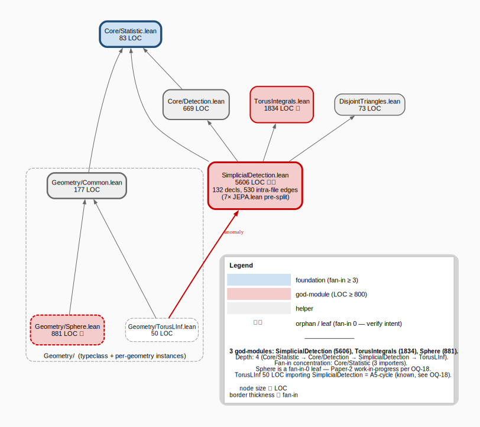
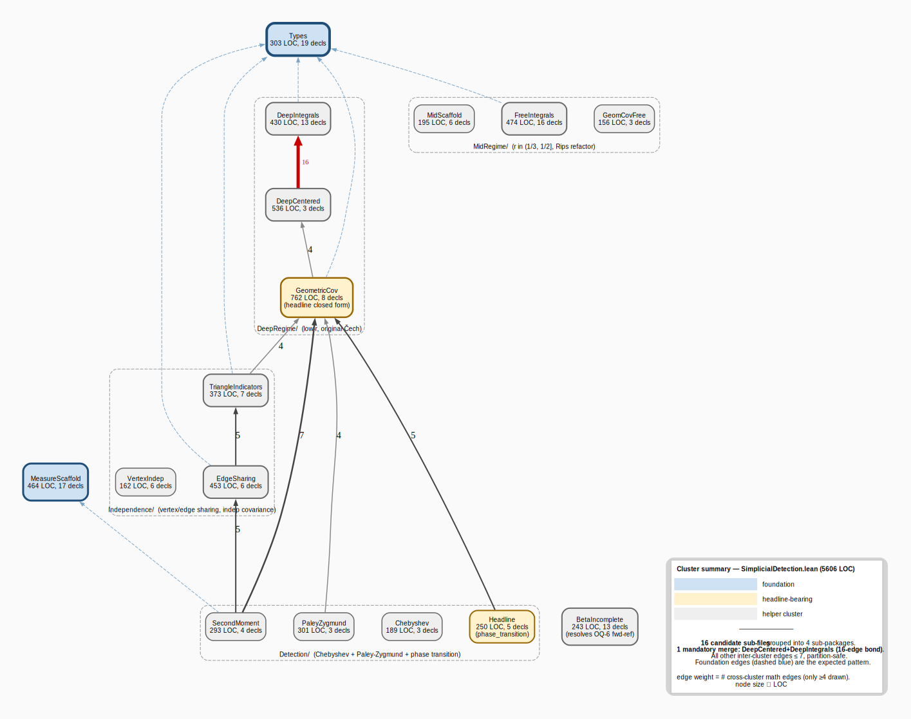

# simplicial-latent-geometry — graph audit

> Audit date: 2026-05-23 (session 96). Protocol: [`wiki/graph-audit-strategy.md`](../../wiki/graph-audit-strategy.md). Framework status: validated on the JEPA-LO refactor ([report](../jepa-learning-order/REPORT-2026-05-23-jepa-split.md)).

---

## Tier 1 — project import graph

Source: [`simplicial-latent-geometry_import_tier1.dot`](simplicial-latent-geometry_import_tier1.dot).

| Metric | Value |
|---|---|
| Files | 9 (excluding umbrella) |
| **Red nodes (LOC ≥ 800)** | **3** — `SimplicialDetection.lean` 5606, `TorusIntegrals.lean` 1834, `Geometry/Sphere.lean` 881 |
| Depth | 4 — `Core/Statistic → Core/Detection → SimplicialDetection → Geometry/TorusLInf` |
| Fan-in concentration | `Core/Statistic` (3 importers) |
| Orphans (fan-in 0) | `Geometry/Sphere` (Paper-2 work-in-progress per OQ-18), `Geometry/TorusLInf` (50 LOC — needs A5-cycle resolution) |
| Structural anomaly | **Geometry/TorusLInf imports SimplicialDetection** (reverse-direction edge — OQ-18 A5 cycle) |

**SSB reference shape is depth 3. This project is depth 4 — close, but the three god-modules make the actual editing surface much worse than the depth metric suggests.** The reading-order signal is loud and one-pointed: tier-3b zoom on `SimplicialDetection.lean` is the highest-leverage move.

---

## Tier 3b — god-module zoom on `SimplicialDetection.lean`

**Raw measurements:** 5606 LOC / 132 declarations / 530 intra-file edges. For comparison: JEPA-LO's `JEPA.lean` pre-split was 2002 / 52 / 112. **SimplicialDetection is ~2.8× the file, ~2.5× the declarations, ~4.7× the edges** — denser as well as larger.

Source: [`simplicial_cluster_summary.dot`](simplicial_cluster_summary.dot).

### Recommended 16-file partition (15 files + the existing root umbrella)

Organized into **4 sub-packages** under `JepaLearningOrder.SimplicialDetection/`:

| Sub-package | File | Predicted LOC | Decls | Role |
|---|---|---|---|---|
| `Core/` | `Types.lean` | 303 | 19 | `Torus`, `CechSample`, `matchRadius`, `volumeFill/Empty`, `fillingProb`, all bounded-above/below lemmas |
| `Core/` | `MeasureScaffold.lean` | 464 | 17 | `cechMeasure`, `cechObservation`, measurability, push-forward isProb |
| `Core/` | `BetaIncomplete.lean` | 243 | 13 | `incBeta_*`, `volumeFill_div_*` ratio block — **resolves OQ-6 forward-reference mess** |
| `DeepRegime/` | `IntegralsAndMoments.lean` ⚠ | **966** | 16 | `edge_integral`/`wedge_integral` family **merged with** `centered_edge_moment` trio — 16-edge bond, mandatory merge |
| `DeepRegime/` | `GeometricCov.lean` | 762 | 8 | `geometricCov_eq_deep` closed form, decay rate, `doubleFill_joint_prob`, doubly-signed triangle integral |
| `MidRegime/` | `Scaffold.lean` | 195 | 6 | `matchRadius_tendsto_half`, `gammaMid_matchRadius_pow_tendsto_pcubed`, etc. |
| `MidRegime/` | `FreeIntegrals.lean` | 474 | 16 | `edgeSet01`/`wedgeSet01` and `*_free` integral family (Rips refactor) |
| `MidRegime/` | `GeomCovFree.lean` | 156 | 3 | `geometricCov_eq`, `_sub_closedForm_tendsto_zero`, `_tendsto_pcubed_compcubed` |
| `Independence/` | `TriangleIndicators.lean` | 373 | 7 | `triangleIndicator'_*`, `single_triangle_integral_eq_g'`, factoring/bounding |
| `Independence/` | `VertexIndep.lean` | 162 | 6 | `shear_measurePreserving_vertex`, `indepFun_*_vertex`, `vertex_sharing_indepFun'` |
| `Independence/` | `EdgeSharing.lean` | 453 | 6 | `edge_sharing_integral_*`, `doublySignedTriangle_cov_*`, `disjoint_triangles_indepFun` |
| `Detection/` | `SecondMoment.lean` | 293 | 4 | `cech_second_moment_structured`, `cech_mean_eq`, `cech_second_moment_bound`, `_memLp` |
| `Detection/` | `PaleyZygmund.lean` | 301 | 3 | `cech_complement_*`, `paleyZygmund_cech_prob_tendsto_one` |
| `Detection/` | `Chebyshev.lean` | 189 | 3 | `chebyshev_single_bound`, `choose3_g_sq_tendsto_atTop`, `chebyshev_2PC_prob_tendsto_zero` |
| `Detection/` | `Headline.lean` | 250 | 5 | `detection_lower_bound{_fixed_d}`, `derive_hSNR`, `derive_hNG`, **`phase_transition`** |

**Totals:** 5584 LOC across 15 sub-modules (+ ~150 LOC for per-file headers ⇒ ~5734 LOC). Largest active file: **`DeepRegime/IntegralsAndMoments.lean` at 966 LOC** — over the 800-LOC threshold but justified by the 16-edge bond (see below). Second-largest: `DeepRegime/GeometricCov.lean` at 762 LOC.

### The one mandatory merge — 16-edge bond

**`DeepCentered` ↔ `DeepIntegrals`: 16 cross-cluster edges.** The centered-moment trio (`centered_edge_moment`, `integrand_fill_rewrite`, `centered_edge_moment_fill`) is the *derivation downstream* of the `edge_integral`/`wedge_integral` family. They cannot be cleanly split. This is the direct analogue of JEPA-LO's `FrobeniusHelpers` ↔ `EncoderConvergence` 11-edge bond, but **stronger** — 16 edges, no plausible interface to draw.

**Resolution:** merge into a single `DeepRegime/IntegralsAndMoments.lean` at 966 LOC. This intentionally violates the 800-LOC god-module threshold; document the violation in the file's header per the structure-vs-intent caveat. Splitting would create 16 new cross-file import dependencies — the exact pathology the audit exists to prevent.

### Other cross-cluster edges (all partition-safe)

The next-highest non-foundation couplings are well under the merge threshold:

| Coupling | Edges | Notes |
|---|---|---|
| `SecondMoment → GeometricCov` | 7 | SecondMoment uses `geometricCov` def + closed-form; clean separation |
| `EdgeSharing → TriangleIndicators` | 5 | EdgeSharing uses indicator infrastructure; clean |
| `SecondMoment → EdgeSharing` | 5 | second moment built from edge-sharing covariance; clean |
| `Headline → GeometricCov` | 5 | phase_transition references closed-form; clean |
| `GeometricCov ↔ DeepCentered` | 4 each way | absorbed into the IntegralsAndMoments merge |

All edges to `Types` (8 clusters point in, counts 6–27) and `MeasureScaffold` (6 clusters point in, counts 1–15) are the **expected foundation pattern** and do not indicate splitting mistakes.

### Self-healing finding — OQ-6 forward-reference mess dissolves

The file currently contains **~13 paired declarations with `'` suffixes** (`incBeta_nonneg`/`'`, `volumeFill_div_le_one`/`'`, `beta_density_integral_le_one`/`'`, etc.). These exist because Lean 4 rejects forward references within a single file (see OQ-6 in `wiki/INDEX.md`) — the unprimed version is declared late, the primed copy is a workaround inserted earlier.

After the split, the primed variants live in different files from their unprimed siblings and the unprimed canonical versions can be re-imported in the natural direction. **~6 primed lemmas become deletable** (~200 LOC savings, in addition to the 5584 → ~5734 reorganization). OQ-6 closes as a side-effect of the split.

### Structure-vs-intent caveats

- **`Geometry/Sphere.lean` (881 LOC, fan-in 0)** is Paper-2 work-in-progress per OQ-18. Red but intentional — do not act on it during this audit cycle.
- **`Geometry/TorusLInf.lean` (50 LOC) importing `SimplicialDetection`** is the known A5 cycle. The split provides an opportunity to resolve it: `TorusLInf` only needs `Core/Types` + `Core/MeasureScaffold` (and the existing `Geometry/Common`), so post-split it can drop its `SimplicialDetection` import entirely.
- **`TorusIntegrals.lean` (1834 LOC)** is the next-priority god-module after this split lands. Defer its own tier-3b to a follow-up session.

---

## Cost / time / risk estimate

| Phase | Estimated time | Risk |
|---|---|---|
| Split execution (sed line-ranges → 15 new files + shim) | ~30 min | Low — protocol is now muscle-memory from JEPA-LO |
| Build cycles (~5 min each, expect 2–3) | ~15 min | Medium — circular Geometry/TorusLInf cycle may surface as a build error and need fixing in the same session |
| Per-file `import`/`open scoped`/`variable` headers | included above | Low |
| Post-split tier-1 re-audit + shim-importer migration | ~20 min | Low — protocol identical to JEPA-LO |
| OQ-6 cleanup (delete ~6 primed-variant lemmas) | ~10 min | Low — mechanical |
| Total | **~75 min** | One session is plausible; two sessions if the TorusLInf cycle needs a non-trivial fix |

**Sorry inventory impact:** zero. No proof body modified.

**Build impact:** new sub-module entries (~15 additions) plus the `JepaLearningOrder.SimplicialDetection/` directory. Expect job count to grow by ~15.

---

## Recommendation

**Proceed with the split.** The signal is clean: one mandatory merge, no other partition surprises, and a free OQ-6 resolution. Risks are concentrated in the Geometry/TorusLInf cycle — resolvable in the same session.

**Naming convention to discuss before execution:** the proposed sub-package root is `JepaLearningOrder.SimplicialDetection/` (mirroring JEPA-LO's `JepaLearningOrder.JEPA/`). Alternative: rename to `SimplicialLatentGeometry.Detection/` since the parent project name is `SimplicialLatentGeometry`. Default to the latter unless there's a reason to keep the JEPA-LO mirror.

**Pre-execution decisions for the user:**
1. Approve the 16-file partition above, or request a different granularity?
2. Approve the `DeepRegime/IntegralsAndMoments.lean` 966-LOC justified-violation, or prefer to accept the 16 cross-file edges instead?
3. Confirm sub-package root name: `SimplicialLatentGeometry/Detection/...` vs. another scheme?
4. Resolve `Geometry/TorusLInf.lean` cycle in the same session, or defer?

---

*Artifacts produced this audit: tier-1 DOT/SVG/PNG, cluster-summary DOT/SVG/PNG, this README. No source code modified.*
